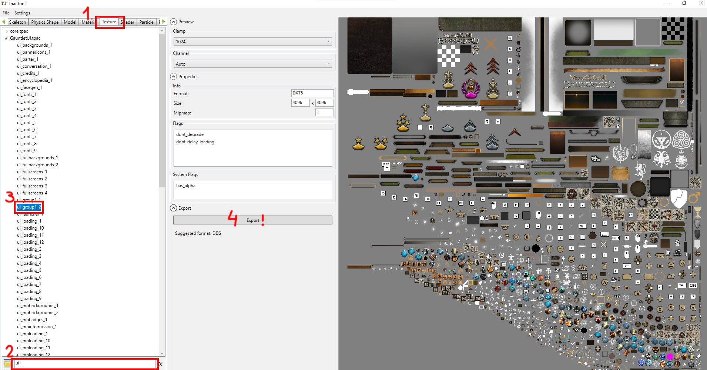
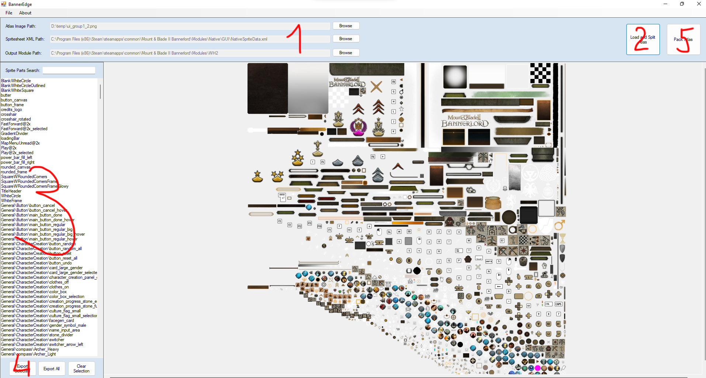

# BannerEdge

BannerEdge is a tool for Bannerlord modding. Its purpose is to provide ease of access to native game UI files by splitting the spritesheet atlas images into its individual sprite parts, because the developer TaleWorlds does not provide these files as part of the official modding kit.

In order for BannerEdge to work, you need to extract the atlas images themselves using the latest release of TpacTool. The UI atlas images' names have "ui" as a prefix, and a number as a suffix as a naming convention.

For example: 
"ui_group_1" - ui_group is the Sprite Category Name, then the number "1" at the end denotes that this spritesheet atlas is the first within that category (there may or may not be more, denoted by sequentially increasing numbers).

>Please note: You do not **need** BannerEdge to mod the atlas images, as it is possible to manipulate the images directly after extracting with TpacTool, but this has the drawback of "guessing" the pixel perfect positions of the individual sprite parts to make sure that they align ingame with other parts. Also, with every new release version, the game developer TaleWorlds regenerates the atlas images themselves and the positions of the individual parts within the atlas shifts around, making your work obsolete and having to start again from scratch. Using BannerEdge in conjunction with the official modding kit avoids this problem.

You can find more information regarding how the game uses sprites in the official modding documentation: http://docs.modding.bannerlord.com/asset-management/generating_and_loading_ui_sprite_sheets/ 

# How to use
#### Prerequisites:
* .NET Framework 4.8 (runtime) https://dotnet.microsoft.com/en-us/download/dotnet-framework/net48
* TpacTool https://github.com/szszss/TpacTool/releases
* Bannerlord the game on Steam platform (if you own the game on any other platform you are out of luck)
* Bannerlord modding kit on Steam platform
* A module created for your mod
**Note**: the versions for the game and the modding kit must match.

Step 1:
Extract the atlas images using TpacTool

Step 2:
Open BannerEdge then:
* Set the path to the SpriteSheetGenerator.exe in the File menu (this executable is part of the official modding kit. The default location is: C:\Program Files (x86)\Steam\steamapps\common\Mount & Blade II Bannerlord\bin\Win64_Shipping_wEditor)
* Browse for the atlas image file you just extracted in step 1.
* Browse for the SpriteData.xml in the Native module
* Set the directory for your module the split sprite parts will be written to
* Hit the "Load and Split Atlas" button
* Wait for the process to finish.

At this point, you should see the loaded atlas file in the main panel and the sprite parts found in a list on the left.
You can either export all the found parts, or select one or more individual parts in the results list. As you click and select parts in the list, the main panel on the right will reflect the selected items.

* Once you are satisfied, hit either of the "Export" buttons. When prompted for the ui category, enter a unique custom name, make sure it is not the same as base game's. Recommended naming convention is "ui_mycategory" for example.
* This will create the necessary files within your module's directory. You can find the extracted sprite parts under "GUI\SpriteParts\". Make sure to not move the images from their automatically created nested folders as the path is important for the game to recognize them.
* You are now free to make changes to the extracted images using your preferred image editor (e.g. GIMP, Photoshop etc.) or replace them outright. If you choose to replace them completely, make sure to keep the dimensions intact otherwise it won't align with other parts ingame.
* Once you are done, go back to BannerEdge and hit the "Pack Atlas" button. This will call the external SpriteSheetGenerator.exe and generate a new atlas file that only contains your edited images. The file will be created in your module's "AssetSources\GauntletUI" folder.
* You need to import the created atlas file into your module using the modding kit. **Make sure you keep the generated atlas image in the GauntletUI folder and don't move it to any other location!**
* DONE